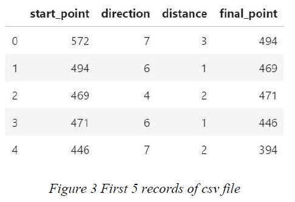

# Artifical Intellegence Guess the Position of the Character
Try to Learn Pattern on Random Game

## Problem Definiton

Let there be a character that moves randomly on a 25 x25 board (can move in eight directions - possible in the corners - and the movement distance remains within the boundaries of the board - if it exceeds the limit stays on the current position). Distance is determined by a random d value between 1 and 3. By designing two different learning algorithms, try to predict which cell the character will move next. Have the character make 50 moves on the board to train the algorithms. Then, calculate the algorithms' prediction errors according to the Manhattan distance and calculate the errors of the algorithms at the end of 30 moves (try to improve learning by using the prediction errors at each move as the learning parameter of your algorithms at the same time).

In order to train the algorithms, let the character make 1000 moves on the board this time from the beginning. When you run your algorithms according to 30 moves again, do they get less errors (is learning taking place)? Interpret your results by comparing with the errors when you trained algorithms with 50 moves.

Extend your board to 50x50 dimensions and let the character make 1000 moves from scratch over the board to train the algorithms. Then, operate your algorithms 30 times, how do your algorithms errors change? 

## Approach to the Problem

### Randomness

Randomness is the absence of a particular pattern or predictability in events [1]. There is no deterministic, mathematically expressed relationship between the outputs obtained from a random process [2]. On the other hand, random numbers can be thought of as random, unknowable, unpredictable numbers [3]. Random numbers are generated using random number generators (RNG). According to the generation method, it is divided into two as pseudorandom number generators (PRNGs) and hardware random-number generators (HRNGs) [4]. While HRNGs are created by using hardware directly, PRNGs are created through software [5].
PRNGs use a mathematical function. Giving an initial value (seed) to this function ensures that the numbers to be produced are produced depending on the seed. If desired, different random values can be generated by changing the seed. Thus, each seed value generates a separate random number sequence [6]. Although the resulting sequences of numbers are periodic, this period is quite long [7].

### Experimental Setup
In this project, we developed a Machine Learning study to test whether the movement of the character on a board, whose direction and distance are generated by random numbers, can be predicted. In this process, we first investigated the learnability of randomness. Afterwards, we determined the number of possible movement points on the game board, other than the point where the character is located. We had ideas on how to learn the game. One of these ideas was to calculate the probabilities of movement and make predictions using those probabilities. However, we thought that the probability would not be enough due to the randomness of the movements. We discussed whether creating a pattern by keeping track of previous movements and learning from it would yield a better result. From this point of view, we thought the movements on the board to a weighted and directed graph. The nodes keep track of the player's location, while the connections between nodes keep track of which point went in which direction and how many times. Another consideration is to include probabilities in this graph model. However, we observed that during the writing phase of the algorithm that created the game, there was also the possibility of determining the moves according to the board constraints. In Figure 1, the possible number of moves of each cell on the board is written on the cells.

The 25x25 game board contains 625 cells. Considering this board, as the character moves from one node to another, its position on the board can be calculated as indicated in Figure 2. We made this calculation by considering the number of 8 directions and distance from 1 to 3.

In order to predict the movement of the game designed with these calculations with machine learning, we determined 2 classifiers. These are Gaussian Naive Bayes and Random Forest Classifiers. We used Python-JupyterLab (version 1.1.4) for the experiments.

### Result

#### Character movement on a 25x25 game board

Due to the game rules, the character cannot move more than 3 steps and cannot go beyond the determined board limits. We arranged the algorithm according to these rules. Thus, when a move is produced that goes out of the board, the character stays where it is.

We thought that the lower left corner of the game board was at the origin. We generated 2 random values (x,y) for the starting point. We randomly generated 8 directions and 3 distances separately. We calculated the produced values and the possible next position with the following relation, and if it falls within the specified limits, we accepted this next position. 

𝐶=𝑛∗(𝑦−1)+𝑥

Here n contains the n*n board size, y contains the value in the y-coordinate, and x contains the value in the x-coordinate.

In the next step, we accepted this point as the starting point. We recorded these movements produced in the desired number in the csv file as in Figure 3.

#### Results of application

The desired stages in the project were carried out, and in addition, classifiers were tested on a larger data set, for example, with 400000 records, to include the entire state space. All obtained results are shown in Table 1 and Table 2 .

### Conclusion
The number of records created for the train in the first 3 stages does not contain the entire state space. Therefore, algorithms could not catch any period in randomly generated sequences. We experimented on a dataset of 400000 records, which we thought would cover the state space. In this condition, it is understood that Random Forest's overfitted accuracy value is 1.0. In short, it is possible to capture periods when a data set large enough to include the state space is used in random sequences produced by PRNG. For Naive Bayes based on probability, it means that it contains the entire state space and it calculates to include all possibilities.

## References

[1] O. U. Press, “Oxford Dictionary: Randomness.” https://www.oxfordlearnersdictionaries.com/definition/english/randomness?q=randomness.

[2] S. L. Miller and D. Childers, “CHAPTER 1 - Introduction,” in Probability and Random Processes (Second Edition), Second Edi., S. L. Miller and D. Childers, Eds. Boston: Academic Press, 2012, pp. 1–5.

[3] İhsan Solak, “UHF RFID ETİKETLER İÇİN SRAM TABANLI DONANIMSAL RASTGELE SAYI ÜRETECİ TASARIMI,” Karadeniz Teknik Üniversitesi, 2008.

[4] VEDAT TAVAS, “Tümleştirmeye uygun rastgele sayı üreteçler,” İstanbul Teknik Üniversitesi, 2011.

[5] G. Dalkılıç, “RADYO FREKANSI İLE TANIMLAMA ETİKETLERİ İÇİN GERÇEK RASTGELE SAYI TABANLI ÜRETEÇ,” Dokuz Eylül Üniversitesi Mühendislik Fakültesi Fen ve Mühendislik Dergisi, vol. 18. Dokuz Eylül Üniversitesi, DOKUZ EYLÜL ÜNİVERSİTESİ MÜHENDİSLİK FAKÜLTESİ TINAZTEPE YERLEŞKESİ 35390 BUCA/İZMİR, pp. 640–651, 2016.

[6] S. Arslan Tuncer and Y. Genç, “İnsan Hareketleri Tabanlı Gerçek Rasgele Sayı Üretimi,” Bitlis Eren Üniversitesi Fen Bilimleri Dergisi, vol. 8. Bitlis Eren Üniversitesi, pp. 261–269, 2019, doi: 10.17798/bitlisfen.445548.

[7] T. Stojanovski and L. Kocarev, “Chaos-based random number generators-part I: analysis [cryptography],” IEEE Trans. Circuits Syst. I Fundam. Theory Appl., vol. 48, no. 3, pp. 281–288, 2001, doi: 10.1109/81.915385.
